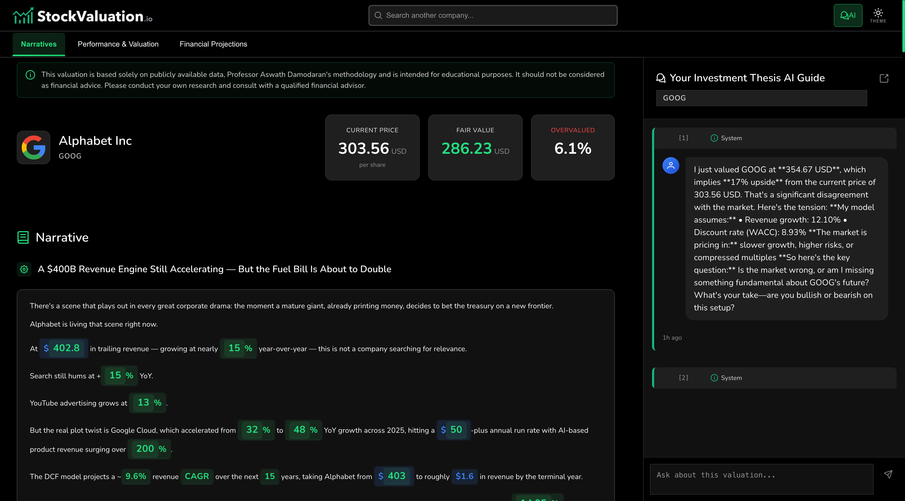

# StockValuation.io

StockValuation.io is a local-first development platform for automated stock valuation using DCF.  
It combines deterministic valuation math with LLM-assisted research and narrative generation.



This is the community/local version of the project and is intended to run entirely on your machine.

## Security Note

- This repository is local-first by design.
- `docker-compose.local.yml` binds ports to `127.0.0.1`.
- Do not deploy these defaults directly to an internet-facing environment.
- Never commit `.env` with real secrets.

## Quick Onboarding (Run Locally)

### 1. Prerequisites

- Docker + Docker Compose
- Git
- Optional: Node.js v22 (only if running frontend outside Docker)

### 2. Configure Environment

```bash
cp .env.example .env
```

Set these required values in `.env`:

- `POSTGRES_PASSWORD`
- `SECRET_KEY`
- `CURRENCY_API_KEY`
- `DEFAULT_PASSWORD`
- At least one LLM key:
`OPENAI_API_KEY` or `ANTHROPIC_API_KEY` or `GROQ_API_KEY` or `GEMINI_API_KEY` or `OPENROUTER_API_KEY`

Recommended:

- `TAVILY_API_KEY` for better news/research quality

### 3. Start the Stack

```bash
docker compose -f docker-compose.local.yml up --build
```

Detached mode:

```bash
docker compose -f docker-compose.local.yml up -d --build
```

### 4. Verify Everything is Up

```bash
docker compose -f docker-compose.local.yml ps
curl http://localhost:5001/health
curl http://localhost:5002/health
```

Open:

- Frontend: `http://localhost:4200`


## System Overview

| Service | Technology | Description |
| :--- | :--- | :--- |
| `frontend` | Angular | Search-first UI for valuation and analysis |
| `valuation-service` | Java 21 + Spring Boot | Deterministic DCF math authority |
| `valuation-agent` | Python + Flask | Agent orchestration and override pipeline |
| `yfinance` | Python | Financial data provider façade |
| `bullbeargpt` | Python | Notebook/chat workflow |
| `postgres` | PostgreSQL 17 | Local persistence and reference data |

## Current API Flow

Main entrypoint:

- `POST /api-s/valuate` with `{ "ticker": "AAPL" }`

Pipeline:

1. Segment mapping
2. News/evidence gathering
3. Baseline Java DCF call
4. Analyzer generates override instructions
5. Recalculate Java DCF with overrides
6. Analyst generates final narrative sections
7. Return merged payload to frontend

Java valuation endpoint used by the agent:

- `POST /api/v1/automated-dcf-analysis/{ticker}/valuation`

## LLM Provider Configuration

Provider selection supports OpenAI, Anthropic, Gemini, Groq, and OpenRouter.

Key env controls:

- `DEFAULT_LLM_PROVIDER`
- `AGENT_LLM_PROVIDER`
- `JUDGE_LLM_PROVIDER`
- `AGENT_LLM_MODEL`
- `JUDGE_LLM_MODEL`

Notes:

- Anthropic and Gemini paths sanitize OpenAI-specific request fields.
- If keys are present but outputs are fallback-like, verify quota/billing.

## Runtime Controls

- `VALUATION_SERVICE_TIMEOUT_SECONDS` controls valuation-agent -> valuation-service timeout.
- Frontend interceptor disables auto-retry for expensive valuation routes (`/api-s/valuate`).

## Useful Commands

Stop services:

```bash
docker compose -f docker-compose.local.yml down
```

Full reset (containers + volumes):

```bash
docker compose -f docker-compose.local.yml down -v
```

View logs:

```bash
docker compose -f docker-compose.local.yml logs -f valuation-agent
docker compose -f docker-compose.local.yml logs -f valuation-service
```

## Troubleshooting

- `403` CORS:
  check `CORS_ORIGINS` in `.env`, then restart.
- Missing required env var:
  compose will fail fast; fill the variable and restart.
- Slow valuations:
  increase `VALUATION_SERVICE_TIMEOUT_SECONDS`.
- Incomplete ticker outputs:
  some upstream symbols have partial fundamentals.

## Project Layout

- `valuation-service/` Java DCF engine
- `valuation-agent/` AI orchestration service
- `frontend/` Angular UI
- `bullbeargpt/` notebook/chat service
- `yfinance/` data provider service
- `docker/` local Postgres init/seeds
- `local_data/` generated local runtime data
- `.etl/` local ETL and regression workspace (not intended for VCS)

## Acknowledgments

Core valuation methodology and reference datasets are based on Aswath Damodaran resources:

- https://pages.stern.nyu.edu/~adamodar/New_Home_Page/data.html
